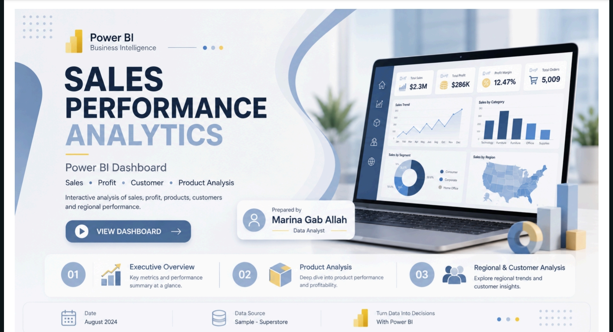
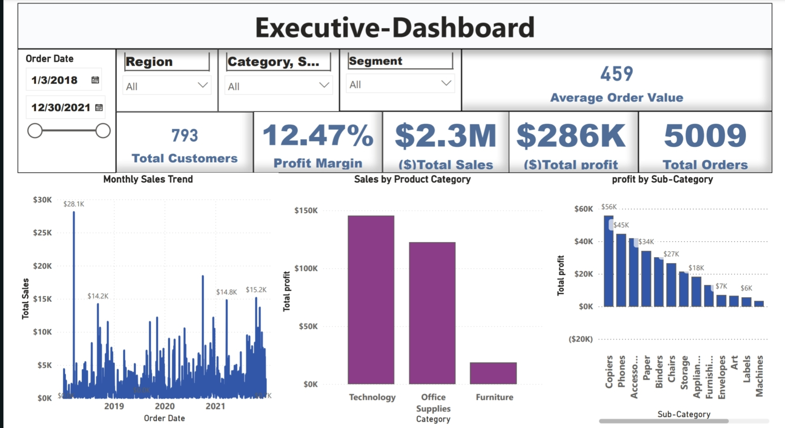
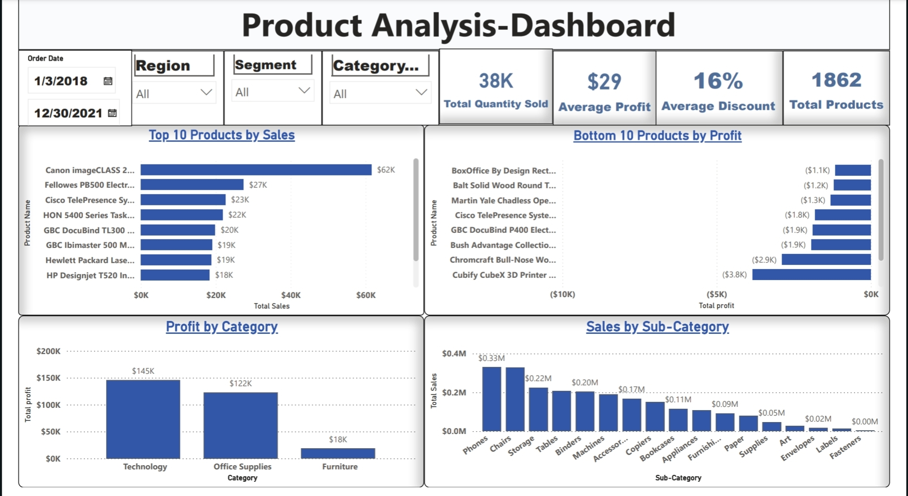
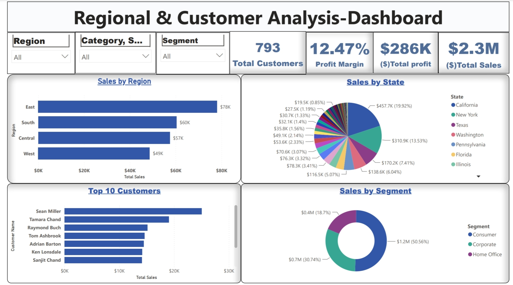

 # 📊 Sales Performance Analytics Dashboard

An interactive Sales Performance Analytics Dashboard built with Microsoft Power BI to analyze sales, profit, customers, products, and regional performance.

## 📌 Project Overview

This project presents an interactive Business Intelligence dashboard designed to provide a clear overview of sales performance and support data-driven decision making.

The dashboard allows users to analyze sales and profitability across different dates, regions, categories, customer segments, products, and customers.

## 📈 Dashboard Pages

### 1. Executive Dashboard

Provides a high-level overview of overall business performance.

**Key KPIs:**
- Total Sales
- Total Profit
- Total Orders
- Total Customers
- Average Order Value
- Profit Margin

The dashboard also includes sales trends over time, sales by category, and profit by sub-category.

### 2. Product Analysis

Focuses on product and category performance to identify the products and sub-categories contributing most to sales and profit.

### 3. Regional & Customer Analysis

Provides insights into:
- Sales by Region
- Sales by State
- Sales by Customer Segment
- Top Customers

## 🔍 Key Insights

The dashboard helps analyze:

- Overall sales and profitability performance
- Sales trends over time
- High-performing product categories
- Most profitable sub-categories
- Regional sales performance
- Customer segment contribution
- Top customers by sales

## 🛠️ Tools & Technologies

- Microsoft Power BI
- DAX
- Microsoft Excel
- Data Visualization
- Business Intelligence

## 📂 Project Files

- `Sales_Performance_Analytics.pbix` — Power BI dashboard
- `Dashboard_Cover.jpg` — Project cover
- `Executive_Dashboard.jpg` — Executive dashboard
- `Product_Analysis.jpg` — Product analysis
- `Regional_Customer_Analysis.jpg` — Regional & customer analysis

## 📷 Dashboard Preview

### Cover

### Executive Dashboard

### Product Analysis

### Regional & Customer Analysis

## 👩‍💻 Author

**Marina Gaballah**

Data Analyst | Power BI | Excel | Business Intelligence

---

⭐ Thank you for visiting this project!
